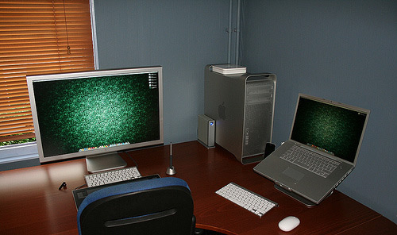

# Visnu Mathews

##  Who are you, and what do you do?

Hi. I am Visnu Mathews and I am a PHP developer

## What hardware do you use?

I am currently using a 13" Mid 2012 MBP. I am also using a Dell Inspiron 1420 which got stuck with Windows Vista Home Premium (might probably format it to Windows 7 or make it a dedicated Ubuntu LTS workstation). 

## And what software?

* Netbeans/SublimeText for coding
* Chrome as my default / favorite browser
* Git for version control
* Github for open source
* iTerm - for my CLI needs
* VirtualBox - for my virtual hosts developments
* Toggl - for time monitoring
* Wunderlist - For my GTD

## What would be your dream setup?

My dream workstation setup is something like this

